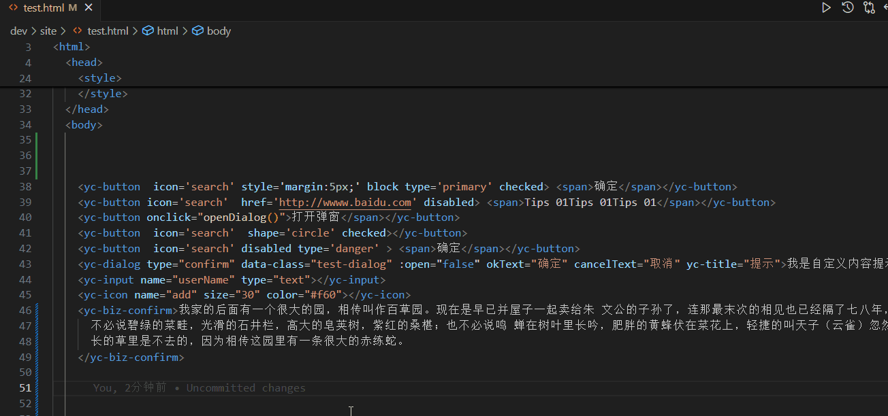

# yc-lit webcomponent dev helper

## 标签自动补全支持
输入 `<yc-` 自动提示补全 yc-lit 组件及属性方法
- 支持html、vue、react（tsx）, jsp 文件的自动补全
- vue 中支持 标签内空格输入`:`自动提示当前tag的属性，输入`@`自动提示当前tag的的事件

## hover 组件信息提示
支持html、vue、react（tsx）、jsp 文件
- 组件 tagName 概述展示
- 在线api及example链接展示
- 当前tag API展示

## 代码片段
输入 `yls-` 自动提示代码片段
- 支持html、vue、react（tsx）、jsp 文件
- 主要包含基础代码片段，持续迭代...

