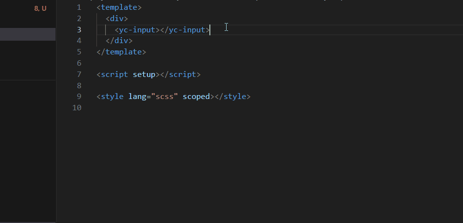

# yc-lit webcomponent dev helper

## 自动补全支持
输入 <yc- 自动提示补全 yc-lit 组件及属性方法
- 支持html、vue 文件的自动补全
- vue 中支持 标签内空格输入`:`自动提示当前tag的属性，输入`@`自动提示当前tag的的事件

## hover 组件信息提示
支持html、vue 文件格式类型
- 组件 tagName 概述展示
- 当前tag API展示
- 在线api及example链接展示

## 未来支持
- 基础代码片段
- 高级代码片段